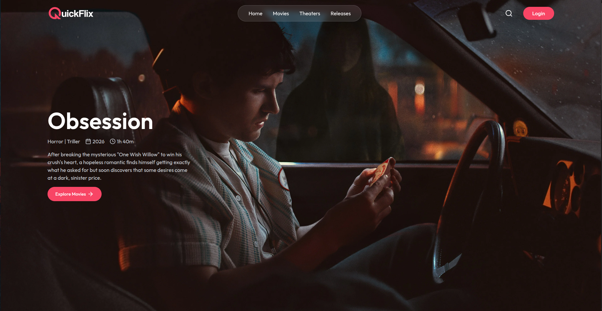
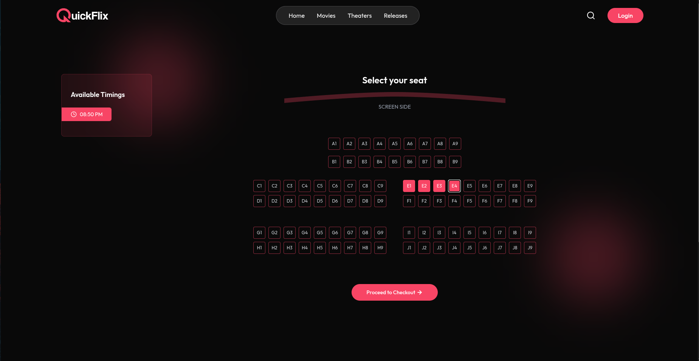
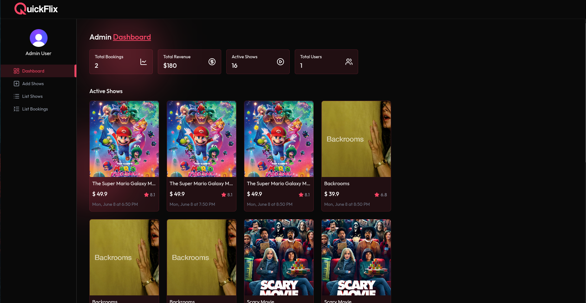

# QuickFlix

A full-stack movie ticket booking application built with React and Node.js. Users can browse movies, choose showtimes, reserve seats, and complete payments through Stripe.





## Tech Stack

**Frontend**

* React
* Vite
* Tailwind CSS
* React Router
* Clerk Authentication

**Backend**

* Node.js
* Express
* MongoDB
* Mongoose
* Stripe
* Inngest
* Nodemailer

## Features

* Browse movies and show details
* Select seats and showtimes
* Secure Stripe checkout
* User booking history
* Admin dashboard for managing shows and bookings

## Getting Started

### Backend

```bash
cd server
npm install
npm run server
```

### Frontend

```bash
cd client
npm install
npm run dev
```

## Environment Variables

### Server

```env
MONGODB_URI=
STRIPE_SECRET_KEY=
CLERK_SECRET_KEY=
```

### Client

```env
VITE_BASE_URL=
VITE_CLERK_PUBLISHABLE_KEY=
VITE_TMDB_IMAGE_BASE_URL=
```

## Screenshots






This project is for educational and portfolio purposes :)
